# OCHI Clone

A pixel-inspired recreation of the [ochi.design](https://ochi.design) presentation agency landing page, built with **Next.js 14 (App Router)**, **Tailwind CSS**, and **Framer Motion**.

> **Disclaimer:** This project is an educational study in recreating a landing page's design and motion. It is not affiliated with, endorsed by, or connected to ochi.design.

## Screenshots

| Hero | Full Screen Menu (Mobile) |
| :---: | :---: |
| 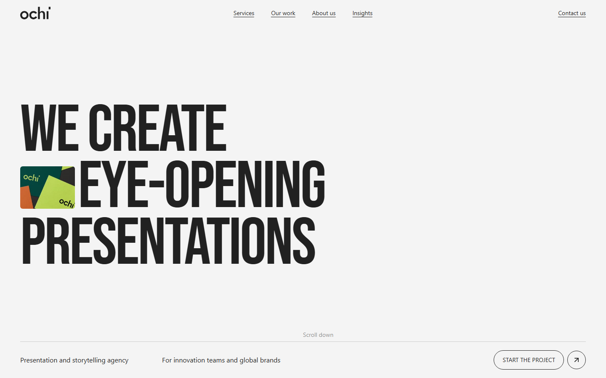 | 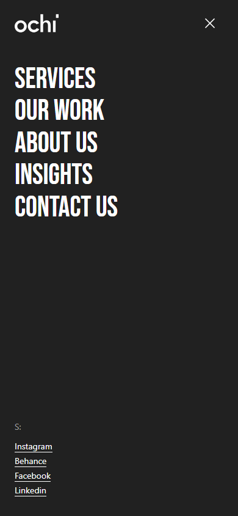 |

| Marquee | About |
| :---: | :---: |
| 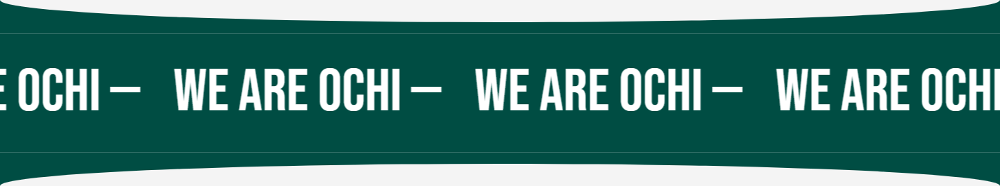 | 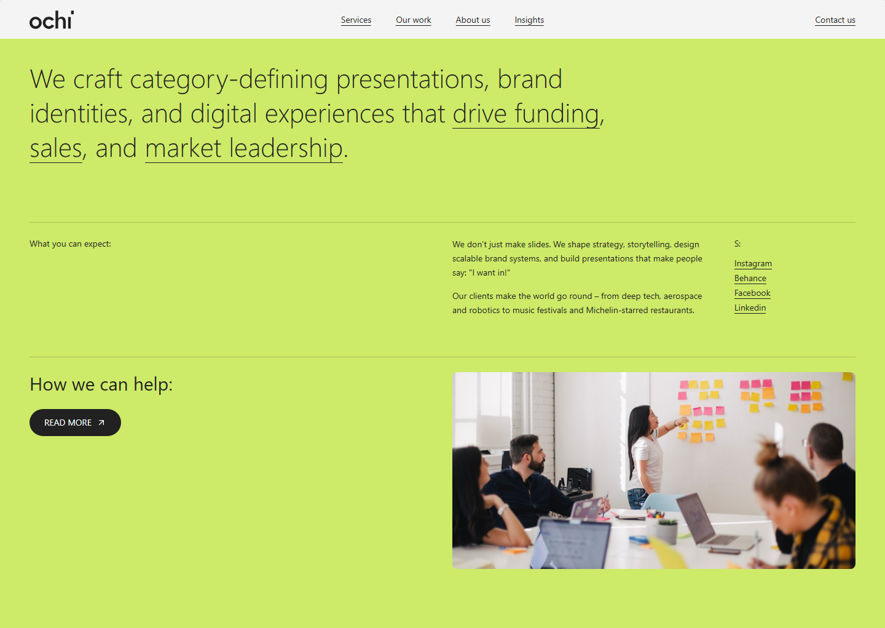 |

| Eyes | Featured Projects |
| :---: | :---: |
| 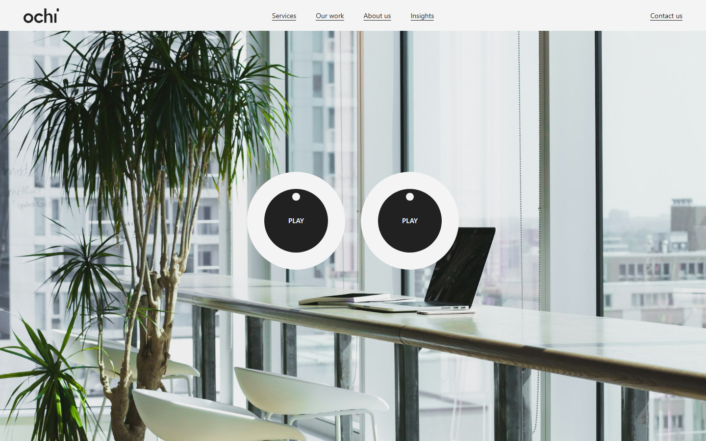 | 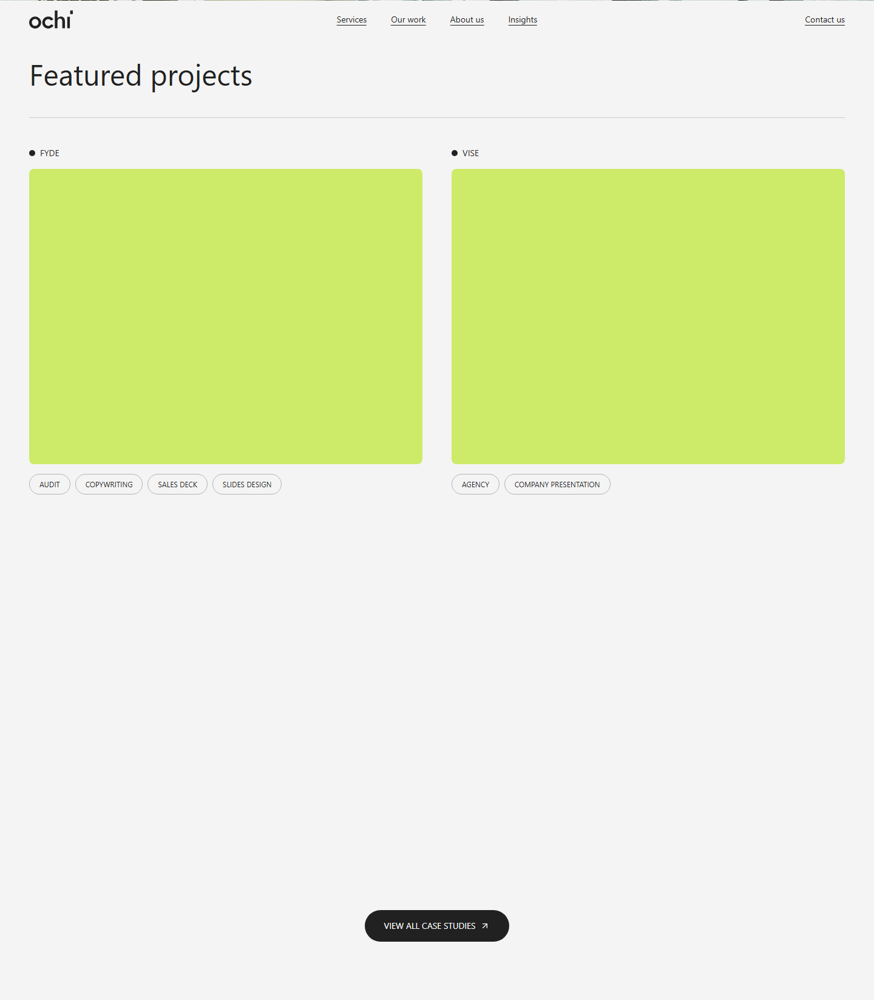 |

| Client Reviews | Awards |
| :---: | :---: |
| 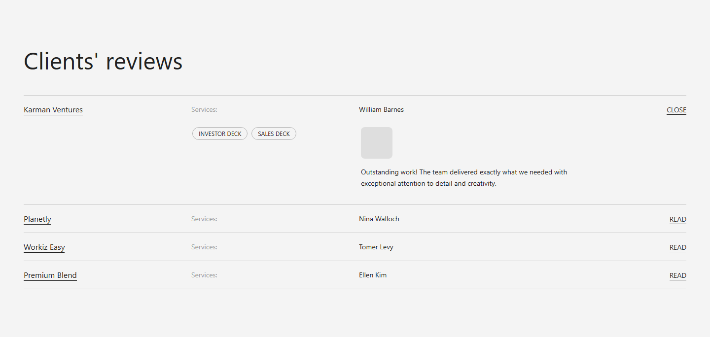 | 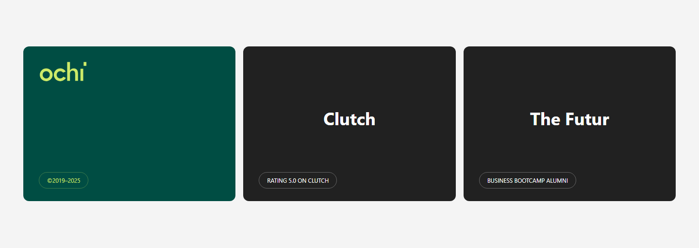 |

| CTA | Footer |
| :---: | :---: |
| 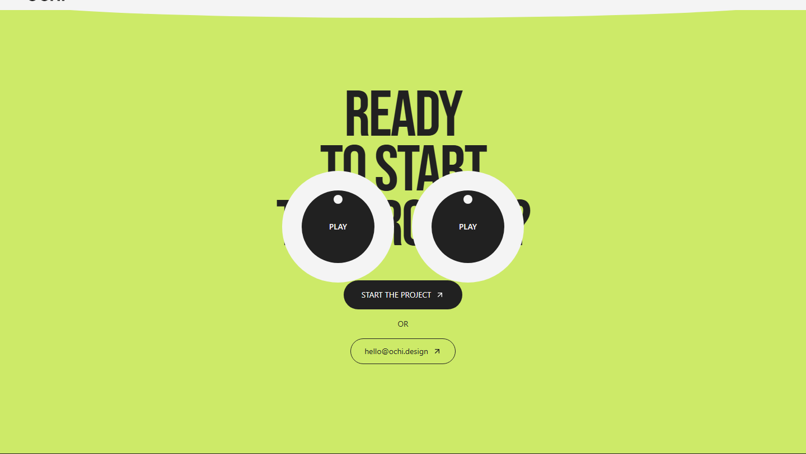 | 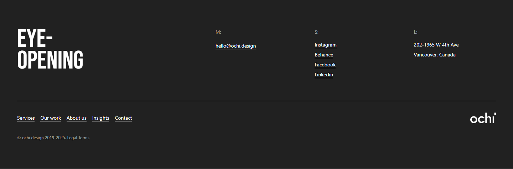 |

<details>
<summary>Full page &amp; mobile</summary>

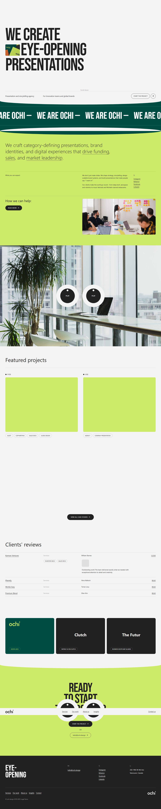

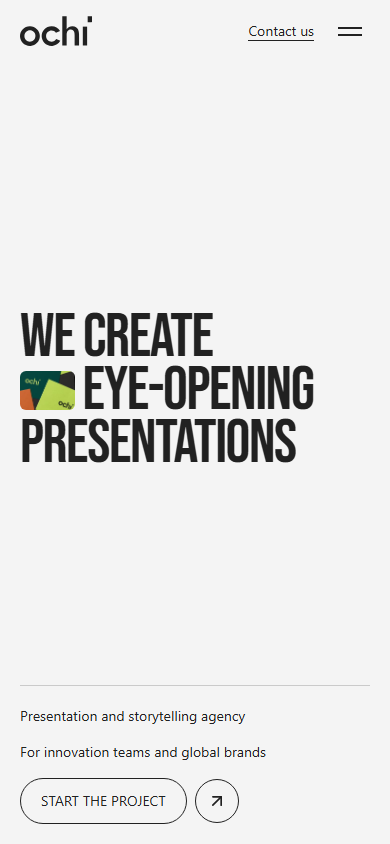

</details>

## Features

- **Animated preloader** — 0–100% counter with slide-up exit transition
- **Mouse-following eyes** — the signature ochi eyeballs, driven by `atan2` cursor tracking
- **Full-screen mobile menu** — clip-path reveal with staggered link animations
- **Infinite marquee** — pure CSS keyframe scroll on the green band
- **Scroll reveals** — section-level `whileInView` entrance animations
- **Accordion reviews** — expandable client review rows
- **Fully responsive** — mobile-first layout with dedicated breakpoints

## Tech Stack

| Layer | Technology |
| --- | --- |
| Framework | [Next.js 14](https://nextjs.org) (App Router, standalone output) |
| Language | JavaScript (JSX) |
| Styling | [Tailwind CSS 3](https://tailwindcss.com) with a custom `ochi-*` palette |
| Animation | [Framer Motion 12](https://www.framer.com/motion/) |
| Icons | [lucide-react](https://lucide.dev) |
| Linting | ESLint (`next/core-web-vitals`) |

## Project Structure

```
ochi-clone/
├── app/
│   ├── globals.css          # Global styles, ochi palette, link/marquee animations
│   ├── layout.js            # Root layout + SEO metadata
│   └── page.js              # Route entry (renders <HomePage />)
├── components/
│   ├── home-page.jsx        # Composition root + preloader state
│   ├── layout/
│   │   ├── navbar.jsx       # Fixed nav with desktop links / mobile hamburger
│   │   ├── full-screen-menu.jsx
│   │   ├── preloader.jsx
│   │   └── footer.jsx
│   ├── sections/
│   │   ├── hero-section.jsx
│   │   ├── marquee-section.jsx
│   │   ├── about-section.jsx
│   │   ├── eyes-section.jsx
│   │   ├── featured-projects-section.jsx
│   │   ├── client-reviews-section.jsx
│   │   ├── awards-section.jsx
│   │   └── cta-section.jsx
│   └── ochi/
│       ├── logo.jsx         # Reusable ochi SVG wordmark
│       └── eyes.jsx         # Mouse-following eyeballs
├── lib/
│   └── data.js              # All site content (links, projects, reviews)
├── docs/
│   └── screenshots/         # App screenshots (see below to regenerate)
├── scripts/
│   └── screenshot.mjs       # Playwright screenshot capture script
└── next.config.js           # Standalone output, security headers
```

## Getting Started

### Prerequisites

- Node.js >= 18.17
- npm

### Install & Run

```bash
# 1. Install dependencies
npm install

# 2. (Optional) configure environment
cp .env.example .env

# 3. Start the dev server
npm run dev
```

Open [http://localhost:3000](http://localhost:3000).

### Scripts

| Command | Description |
| --- | --- |
| `npm run dev` | Start the development server |
| `npm run build` | Create a production build (standalone output) |
| `npm run start` | Serve the production build |
| `npm run lint` | Run ESLint |

### Environment Variables

| Variable | Default | Description |
| --- | --- | --- |
| `NEXT_PUBLIC_BASE_URL` | `http://localhost:3000` | Base URL used for SEO metadata / canonical URLs |

## Regenerating Screenshots

The screenshots in `docs/screenshots/` are captured with Playwright from the running app:

```bash
npm install                       # includes the playwright dev dependency
npx playwright install chromium   # one-time browser download
npm run build && npm run start    # serve the app on :3000
node scripts/screenshot.mjs       # writes docs/screenshots/*.png
```

## Deployment

- **Vercel** — zero-config; the app is a fully static landing page.
- **Docker / self-hosted** — the build produces a standalone server (`output: 'standalone'`), so you can run `node .next/standalone/server.js` inside a minimal container.

## Acknowledgments

- Design inspiration: [ochi.design](https://ochi.design) — all brand assets and copy belong to their respective owners.
- Placeholder imagery hot-linked from [Unsplash](https://unsplash.com).
